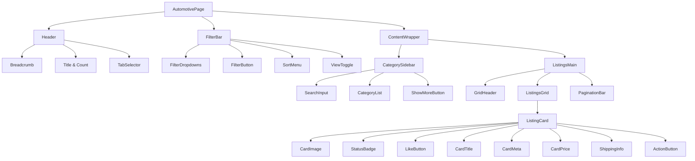
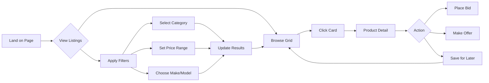

# 🚗 Automotive Category Layout Design

## UX Goals & Design Philosophy

**Vision**: Create a clean, data-driven automotive browsing experience that prioritizes information density, quick scanning, and efficient filtering for serious car buyers and collectors.

**User Experience Goals**:
- **Professional & Trustworthy**: High-end aesthetic that instills confidence in high-value transactions
- **Information-Dense**: Display critical vehicle specs without overwhelming the user
- **Fast Filtering**: Enable users to narrow down 60k+ listings to their dream car in seconds
- **Mobile-First**: Seamless experience across desktop, tablet, and mobile devices
- **Scannable**: Clear visual hierarchy allows users to process listings quickly

**Design Feel**:
- Clean, minimalist white backgrounds with strategic use of brand colors
- Modern sans-serif typography (Inter/Helvetica-style)
- Subtle shadows and borders for depth without clutter
- Generous whitespace for breathing room
- Consistent grid alignment and spacing

---

## 📐 Page Structure

### 1. Header Area

#### Breadcrumb Navigation
```
Home > Categories > eBay Motors > Cars & Trucks
```

**Specifications**:
- **Font Size**: 14px
- **Color**: Light: `#64748B`, Dark: `#CBD5E1`
- **Separator**: Chevron right icon (›)
- **Hover State**: Text color changes to `#FFA239`
- **Mobile**: Collapsible - show only last 2 levels

#### Main Title & Results Count
```
┌─────────────────────────────────────────────────┐
│  Cars & Trucks                    61,665 results │
└─────────────────────────────────────────────────┘
```

**Specifications**:
- **Title Font**: 32px, Bold (24px on mobile)
- **Results Count**: 16px, Regular, Gray (`#64748B`)
- **Alignment**: Left-aligned title, right-aligned count
- **Spacing**: 24px padding vertical, 32px horizontal

#### Tab Filters (Primary Navigation)
```
┌──────────────────────────────────────────────┐
│  [All Listings] [Auction] [Buy Now] [Offer] │
└──────────────────────────────────────────────┘
```

**Specifications**:
- **Style**: Pill-shaped tabs with rounded borders
- **Active Tab**:
  - Background: `#FFA239`
  - Text: White
  - Bold weight
- **Inactive Tab**:
  - Background: Transparent
  - Border: 1.5px solid `#E2E8F0`
  - Text: `#64748B`
- **Hover**: Border color changes to `#FFA239`
- **Mobile**: Horizontal scroll with snap points

---

### 2. Top Filter Bar

```
┌──────────────────────────────────────────────────────────────┐
│ [Transmission ▼] [Make ▼] [Model ▼] [Title ▼] [Year ▼]     │
│ [Condition ▼] [Price ▼]     [🔍 Filter]    [Sort: Best ▼]  │
└──────────────────────────────────────────────────────────────┘
```

**Layout**:
- **Desktop**: Two rows, filters wrap gracefully
- **Tablet**: Single scrollable row
- **Mobile**: Collapsed into "Filters" button with bottom sheet

**Filter Dropdown Specifications**:
- **Size**: 140px width minimum, auto-expand for content
- **Height**: 44px
- **Border**: 1.5px solid `#E2E8F0`
- **Border Radius**: 8px
- **Icon**: Chevron down, transitions to up when opened
- **Active Filter Badge**: Small blue dot (`#8CE4FF`) next to filter name

**Filter Button (Primary CTA)**:
```css
background: #FFA239
color: white
padding: 12px 24px
border-radius: 8px
font-weight: 600
hover: background: #E68A1F
```

**Sort Dropdown**:
- **Position**: Right-aligned
- **Options**: Best Match, Price: Low to High, Price: High to Low, Newest First, Ending Soon
- **Icon**: Sort icon (⇅) + Chevron

**View Toggle**:
- **Position**: Far right
- **Icons**: Grid view (⊞) and List view (☰)
- **Active State**: Primary color fill
- **Mobile**: Hidden (always use list view)

---

### 3. Left Sidebar

```
┌────────────────────┐
│ Shop by Category   │
├────────────────────┤
│ 🔍 Search brands   │
├────────────────────┤
│ □ 2002            │
│ □ 240SX           │
│ □ AMC             │
│ □ Aston Martin    │
│ □ Audi         (2k)│
│ □ BMW          (5k)│
│ □ Bentley         │
│ □ Buick           │
│ ⋮                 │
│ [Show More]       │
└────────────────────┘
```

**Specifications**:
- **Width**: 260px (fixed on desktop)
- **Position**: Sticky, top: 80px
- **Max Height**: calc(100vh - 100px)
- **Overflow**: Scroll with custom scrollbar
- **Background**: Light: White, Dark: `#1E293B`
- **Border**: 1px solid `#E2E8F0` (right side only)

**Search Input**:
- **Placeholder**: "Search brands..."
- **Icon**: Magnifying glass
- **Size**: 40px height
- **Debounce**: 300ms filter delay

**Category Checkboxes**:
- **Font Size**: 15px
- **Item Height**: 40px
- **Hover State**: Background `#FFF5EB` (light orange tint)
- **Count Badge**:
  - Right-aligned
  - Gray text `#94A3B8`
  - Format: (1.2k) for thousands
- **Selected State**:
  - Checkbox: `#FFA239`
  - Text: Bold weight

**Show More Button**:
- **Style**: Text button
- **Color**: `#FFA239`
- **Hover**: Underline
- **Expands**: Reveals all 100+ brands

**Mobile Behavior**:
- Collapses into "Filters" bottom sheet
- Opens with slide-up animation
- Full-screen overlay with close button
- Sticky "Apply Filters" button at bottom

---

### 4. Main Content Section

#### Grid Layout
```
┌─────────────────────────────────────────────────────────┐
│  ┌──────┐  ┌──────┐  ┌──────┐                          │
│  │ Card │  │ Card │  │ Card │                          │
│  └──────┘  └──────┘  └──────┘                          │
│                                                          │
│  ┌──────┐  ┌──────┐  ┌──────┐                          │
│  │ Card │  │ Card │  │ Card │                          │
│  └──────┘  └──────┘  └──────┘                          │
└─────────────────────────────────────────────────────────┘
```

**Grid Specifications**:
- **Desktop (>1200px)**: 3 columns, 24px gap
- **Tablet (768px-1200px)**: 2 columns, 20px gap
- **Mobile (<768px)**: 1 column, 16px gap
- **Layout**: CSS Grid with auto-fill
- **Padding**: 32px container padding

---

### 5. Listing Card Design

```
┌─────────────────────────────────────────┐
│  ┌───────────────────────────────────┐  │
│  │                                   │  │
│  │         [Car Image]               │  │
│  │                                   │  │
│  │  🏷️ NEW LISTING      ♡ 24        │  │
│  └───────────────────────────────────┘  │
│                                          │
│  1971 Ford Torino Cobra Jet Shaker      │
│  Hood 351 Cleveland C6                  │
│                                          │
│  Pre-Owned · Ford · Coupe               │
│                                          │
│  ┌──────────────────────────────────┐   │
│  │  $12,000.00                      │   │
│  │  or Best Offer                   │   │
│  └──────────────────────────────────┘   │
│                                          │
│  📍 Local Pickup · Dallas, TX           │
│  🚚 Shipping: +$500                     │
│                                          │
│  [View Details]                          │
└─────────────────────────────────────────┘
```

#### Card Component Breakdown

**Container**:
```css
background: white (light) / #1E293B (dark)
border: 1px solid #E2E8F0
border-radius: 12px
overflow: hidden
box-shadow: 0 2px 8px rgba(0,0,0,0.08)
transition: all 0.3s ease
cursor: pointer

hover:
  box-shadow: 0 12px 24px rgba(0,0,0,0.15)
  transform: translateY(-4px)
```

**Image Container**:
- **Aspect Ratio**: 4:3
- **Object Fit**: Cover
- **Lazy Loading**: Yes
- **Placeholder**: Gray skeleton with car icon
- **Hover Effect**: Slight zoom (scale: 1.05)

**Status Badge** (NEW LISTING):
- **Position**: Absolute, top-left, 12px offset
- **Background**: `#8CE4FF` (secondary blue)
- **Text**: White, 12px, Bold, uppercase
- **Padding**: 6px 12px
- **Border Radius**: 6px
- **Shadow**: 0 2px 4px rgba(0,0,0,0.2)
- **Other Variants**:
  - ENDING SOON: `#FEEE91` (yellow) with dark text
  - SOLD: `#FF5656` (red) with white text
  - FEATURED: `#FFA239` (orange) with white text

**Like Button**:
- **Position**: Absolute, top-right, 12px offset
- **Size**: 36px circle
- **Background**: White with 90% opacity
- **Icon**: Heart outline (empty) or filled (liked)
- **Icon Color**: `#FF5656`
- **Like Count**: Small text below icon
- **Animation**: Scale + color change on click

**Title**:
- **Font Size**: 16px
- **Font Weight**: 600 (Semi-bold)
- **Line Height**: 1.4
- **Max Lines**: 2 lines with ellipsis (...)
- **Color**: Light: `#2c3e50`, Dark: `#F1F5F9`
- **Spacing**: 12px padding top/bottom

**Metadata Row** (Pre-Owned · Ford · Coupe):
- **Font Size**: 14px
- **Color**: `#64748B` (gray)
- **Separator**: Middle dot (·)
- **Icons**: Optional small icons before text
- **Spacing**: 8px bottom margin

**Price Section**:
```
┌──────────────────────┐
│  $12,000.00          │  ← Primary price (24px, Bold, #FFA239)
│  or Best Offer       │  ← Secondary info (14px, Gray)
└──────────────────────┘
```

**Price Specifications**:
- **Primary Price**:
  - Font: 24px, Bold
  - Color: `#FFA239` (primary orange)
- **Secondary Pricing**:
  - "or Best Offer"
  - "Starting Bid: $10,000"
  - Font: 14px, Regular
  - Color: `#64748B`
- **Discount Badge** (if applicable):
  - Show original price with strikethrough
  - Display savings percentage

**Location & Shipping Info**:
- **Icons**: Location pin, truck
- **Font Size**: 13px
- **Color**: `#64748B`
- **Layout**: Stacked vertically
- **Spacing**: 8px between items

**Action Button** (View Details):
```css
width: 100%
padding: 12px
background: transparent
border: 1.5px solid #FFA239
color: #FFA239
border-radius: 8px
font-weight: 600
transition: all 0.2s

hover:
  background: #FFA239
  color: white
```

---

### 6. Pagination

```
┌────────────────────────────────────────┐
│  [← Previous]  1 2 3 ... 50  [Next →] │
└────────────────────────────────────────┘
```

**Specifications**:
- **Position**: Bottom center
- **Button Style**: Same as primary buttons
- **Active Page**: Solid background `#FFA239`
- **Inactive Pages**: Gray text with hover effect
- **Ellipsis**: Show when > 7 pages
- **Scroll Behavior**: Scroll to top on page change

---

## 📱 Mobile Version

### Key Differences

#### 1. Sticky Filter Bar (Bottom)
```
┌─────────────────────────────────────┐
│  [🔍 Filters (3)]    [Sort ▼]  [⊞] │
└─────────────────────────────────────┘
```
- **Position**: Fixed bottom, above tab bar
- **Height**: 56px
- **Background**: White with shadow
- **Badge**: Shows active filter count

#### 2. Filter Bottom Sheet
- **Trigger**: Tap "Filters" button
- **Animation**: Slide up from bottom
- **Height**: 80vh with drag handle
- **Sections**:
  - Quick Filters (chips)
  - Advanced Filters (accordions)
  - Applied Filters (removable chips)
- **Footer**:
  - "Clear All" (left)
  - "Apply Filters" (right, primary button)

#### 3. Card Layout
- **Width**: Full width minus 16px padding
- **Image Aspect**: 16:9 (wider for mobile)
- **Swipe Actions**:
  - Swipe left: Add to favorites
  - Swipe right: Quick view
- **Tap Actions**:
  - Tap card: View details
  - Tap image: Open gallery
  - Tap heart: Toggle favorite

#### 4. Infinite Scroll
- Replace pagination with infinite scroll
- Load indicator at bottom
- "Back to top" floating button

---

## 🎨 Design Characteristics

### Color Usage

#### Brand Colors
```css
--primary: #FFA239     /* CTAs, prices, active states */
--secondary: #8CE4FF   /* Badges, info highlights */
--warning: #FEEE91     /* Urgent notices, ending soon */
--danger: #FF5656      /* Errors, sold badges */
```

#### Neutral Colors
```css
/* Light Mode */
--bg-primary: #FFFFFF
--bg-secondary: #F8FAFC
--text-primary: #0F172A
--text-secondary: #64748B
--border: #E2E8F0

/* Dark Mode */
--bg-primary: #0F172A
--bg-secondary: #1E293B
--text-primary: #F1F5F9
--text-secondary: #CBD5E1
--border: #334155
```

### Typography

**Font Stack**:
```css
font-family: 'Inter', -apple-system, BlinkMacSystemFont, 'Segoe UI',
             Roboto, Helvetica, Arial, sans-serif;
```

**Type Scale**:
- **H1** (Page Title): 32px / 700
- **H2** (Section Title): 24px / 700
- **H3** (Card Title): 16px / 600
- **Body**: 15px / 400
- **Caption**: 13px / 400
- **Small**: 12px / 400

### Spacing System
```
4px   - xs   (icon gaps)
8px   - sm   (element padding)
12px  - md   (card padding)
16px  - lg   (section gaps)
24px  - xl   (section padding)
32px  - 2xl  (page padding)
48px  - 3xl  (section margins)
```

### Border Radius
```
4px   - xs   (badges)
8px   - sm   (buttons, inputs)
12px  - md   (cards)
16px  - lg   (modals)
24px  - xl   (bottom sheets)
```

### Shadows
```css
/* Card Shadow */
box-shadow: 0 2px 8px rgba(0, 0, 0, 0.08);

/* Card Hover Shadow */
box-shadow: 0 12px 24px rgba(0, 0, 0, 0.15);

/* Dropdown Shadow */
box-shadow: 0 4px 16px rgba(0, 0, 0, 0.12);

/* Modal Shadow */
box-shadow: 0 20px 60px rgba(0, 0, 0, 0.25);
```

---

## 🧩 Component Architecture

### Reusable UI Components

#### 1. `<ListingCard>`
**Props**:
```typescript
interface ListingCardProps {
  listing: {
    id: string;
    title: string;
    price: number;
    images: string[];
    condition: string;
    location: string;
    badge?: 'new' | 'featured' | 'ending-soon';
    likes: number;
    shipping?: {
      available: boolean;
      cost: number;
    };
  };
  onLike?: (id: string) => void;
  onView?: (id: string) => void;
  variant?: 'grid' | 'list';
}
```

**Sub-components**:
- `<CardImage>` - Image with lazy loading
- `<CardBadge>` - Status badges
- `<CardTitle>` - Truncated title
- `<CardMeta>` - Metadata row
- `<CardPrice>` - Price formatting
- `<CardActions>` - Buttons and likes

#### 2. `<CategorySidebar>`
**Props**:
```typescript
interface CategorySidebarProps {
  categories: Category[];
  selected: string[];
  onSelect: (categoryIds: string[]) => void;
  searchable?: boolean;
  collapsible?: boolean;
}
```

**Features**:
- Searchable category list
- Checkbox selection
- Count badges
- "Show more" expansion
- Mobile bottom sheet variant

#### 3. `<FilterBar>`
**Props**:
```typescript
interface FilterBarProps {
  filters: Filter[];
  activeFilters: Record<string, any>;
  onFilterChange: (filters: Record<string, any>) => void;
  sortOptions: SortOption[];
  currentSort: string;
  onSortChange: (sort: string) => void;
}
```

**Sub-components**:
- `<FilterDropdown>` - Individual filter
- `<FilterChip>` - Applied filter badge
- `<SortMenu>` - Sort dropdown
- `<ViewToggle>` - Grid/List toggle

#### 4. `<SortMenu>`
**Props**:
```typescript
interface SortMenuProps {
  options: Array<{
    label: string;
    value: string;
    icon?: string;
  }>;
  value: string;
  onChange: (value: string) => void;
}
```

#### 5. `<Breadcrumb>`
**Props**:
```typescript
interface BreadcrumbProps {
  items: Array<{
    label: string;
    href: string;
  }>;
  maxItems?: number; // Mobile truncation
}
```

#### 6. `<TabSelector>`
**Props**:
```typescript
interface TabSelectorProps {
  tabs: Array<{
    label: string;
    value: string;
    count?: number;
  }>;
  active: string;
  onChange: (value: string) => void;
}
```

#### 7. `<PaginationBar>`
**Props**:
```typescript
interface PaginationBarProps {
  currentPage: number;
  totalPages: number;
  onPageChange: (page: number) => void;
  variant?: 'pages' | 'infinite';
}
```

---

## 🛠️ Developer Implementation Guide

### Responsive Layout Structure

```jsx
<div className="automotive-page">
  {/* Header */}
  <header className="page-header">
    <Breadcrumb items={breadcrumbs} />
    <div className="title-row">
      <h1>Cars & Trucks</h1>
      <span className="results-count">61,665 results</span>
    </div>
    <TabSelector tabs={tabs} active={activeTab} />
  </header>

  {/* Filter Bar */}
  <FilterBar
    filters={filters}
    activeFilters={activeFilters}
    onFilterChange={handleFilterChange}
  />

  {/* Main Content */}
  <div className="content-wrapper">
    {/* Sidebar */}
    <aside className="sidebar">
      <CategorySidebar
        categories={categories}
        selected={selectedCategories}
        onSelect={handleCategorySelect}
      />
    </aside>

    {/* Listings Grid */}
    <main className="listings-grid">
      <div className="grid-header">
        <span>{filteredCount} listings</span>
        <div className="grid-controls">
          <SortMenu
            options={sortOptions}
            value={currentSort}
            onChange={handleSortChange}
          />
          <ViewToggle
            value={viewMode}
            onChange={setViewMode}
          />
        </div>
      </div>

      <div className={`listings-container ${viewMode}`}>
        {listings.map(listing => (
          <ListingCard
            key={listing.id}
            listing={listing}
            variant={viewMode}
            onLike={handleLike}
            onView={handleView}
          />
        ))}
      </div>

      <PaginationBar
        currentPage={page}
        totalPages={totalPages}
        onPageChange={handlePageChange}
      />
    </main>
  </div>
</div>
```

### CSS Grid Implementation

```css
/* Desktop Layout */
.content-wrapper {
  display: grid;
  grid-template-columns: 260px 1fr;
  gap: 32px;
  max-width: 1440px;
  margin: 0 auto;
  padding: 32px;
}

/* Listings Grid */
.listings-container.grid {
  display: grid;
  grid-template-columns: repeat(auto-fill, minmax(320px, 1fr));
  gap: 24px;
}

/* List View */
.listings-container.list {
  display: flex;
  flex-direction: column;
  gap: 16px;
}

/* Tablet */
@media (max-width: 1200px) {
  .content-wrapper {
    grid-template-columns: 220px 1fr;
    gap: 24px;
  }

  .listings-container.grid {
    grid-template-columns: repeat(auto-fill, minmax(280px, 1fr));
  }
}

/* Mobile */
@media (max-width: 768px) {
  .content-wrapper {
    grid-template-columns: 1fr;
    padding: 16px;
  }

  .sidebar {
    display: none; /* Hidden, replaced by bottom sheet */
  }

  .listings-container.grid {
    grid-template-columns: 1fr;
  }
}
```

### API Integration

```typescript
// Listing fetch with filters
async function fetchListings(params: {
  category?: string[];
  filters: Record<string, any>;
  sort: string;
  page: number;
  limit: number;
}) {
  const response = await api.get('/api/listings/automotive', {
    params: {
      ...params.filters,
      category: params.category?.join(','),
      sort: params.sort,
      page: params.page,
      limit: params.limit,
    },
  });

  return {
    listings: response.data.listings,
    total: response.data.total,
    pages: response.data.pages,
  };
}

// Infinite scroll for mobile
function useInfiniteListings() {
  const [listings, setListings] = useState([]);
  const [page, setPage] = useState(1);
  const [hasMore, setHasMore] = useState(true);

  const loadMore = async () => {
    const newListings = await fetchListings({
      ...filters,
      page: page + 1,
    });

    setListings(prev => [...prev, ...newListings.listings]);
    setPage(page + 1);
    setHasMore(newListings.listings.length > 0);
  };

  return { listings, loadMore, hasMore };
}
```

---

## 📊 Component Diagram



---

## 🎯 User Flow Diagram



---

## 🔄 State Management

```typescript
// Filter State
interface FilterState {
  categories: string[];
  transmission: string[];
  make: string[];
  model: string[];
  yearMin: number;
  yearMax: number;
  priceMin: number;
  priceMax: number;
  condition: string[];
  title: string[];
}

// Sort State
type SortOption =
  | 'best-match'
  | 'price-low-high'
  | 'price-high-low'
  | 'newest'
  | 'ending-soon'
  | 'distance';

// View State
type ViewMode = 'grid' | 'list';

// Page State
interface PageState {
  filters: FilterState;
  sort: SortOption;
  view: ViewMode;
  page: number;
  selectedCategories: string[];
}
```

---

## ✅ Accessibility Checklist

- [ ] All interactive elements have focus states
- [ ] Keyboard navigation works for all filters
- [ ] Screen reader labels on all icon buttons
- [ ] Color contrast meets WCAG AA (4.5:1 for text)
- [ ] Skip to content link available
- [ ] ARIA labels on dynamic content
- [ ] Form inputs have associated labels
- [ ] Error messages are announced
- [ ] Modal focus trap implemented
- [ ] Reduced motion option respected

---

## 🚀 Performance Optimizations

### Image Loading
```typescript
// Lazy loading with intersection observer

```

### Virtual Scrolling
- Implement virtual scrolling for 1000+ items
- Render only visible items + buffer
- Reuse DOM nodes for better performance

### API Optimization
- Debounce search/filter inputs (300ms)
- Cache filter results with React Query
- Prefetch next page on scroll
- Compress images (WebP with fallback)

### Bundle Size
- Code-split by route
- Lazy load filter components
- Tree-shake unused code
- Use dynamic imports for heavy components

---

## 📱 Responsive Breakpoints

```css
/* Mobile First Approach */
/* Base: Mobile (320px - 767px) */

/* Tablet */
@media (min-width: 768px) {
  /* 2 column grid */
}

/* Desktop */
@media (min-width: 1024px) {
  /* 3 column grid + sidebar */
}

/* Large Desktop */
@media (min-width: 1440px) {
  /* Max width container, larger gaps */
}

/* Extra Large */
@media (min-width: 1920px) {
  /* 4 column grid option */
}
```

---

## 🎨 Animation & Transitions

```css
/* Card Hover */
.listing-card {
  transition: all 0.3s cubic-bezier(0.4, 0, 0.2, 1);
}

.listing-card:hover {
  transform: translateY(-4px);
  box-shadow: 0 12px 24px rgba(0, 0, 0, 0.15);
}

/* Filter Dropdown */
.filter-dropdown {
  animation: slideDown 0.2s ease-out;
}

@keyframes slideDown {
  from {
    opacity: 0;
    transform: translateY(-8px);
  }
  to {
    opacity: 1;
    transform: translateY(0);
  }
}

/* Bottom Sheet (Mobile) */
.bottom-sheet {
  animation: slideUp 0.3s cubic-bezier(0.4, 0, 0.2, 1);
}

@keyframes slideUp {
  from {
    transform: translateY(100%);
  }
  to {
    transform: translateY(0);
  }
}
```

---

## 📋 Feature Priority

### Phase 1 (MVP)
- ✅ Basic grid layout
- ✅ Filter by category
- ✅ Sort options
- ✅ Pagination
- ✅ Listing cards with essential info

### Phase 2 (Enhanced)
- 🔲 Advanced filters (price, year, condition)
- 🔲 Search within category
- 🔲 Save searches
- 🔲 Like/favorite functionality
- 🔲 Mobile bottom sheet filters

### Phase 3 (Premium)
- 🔲 Map view of listings
- 🔲 Comparison tool (compare up to 4 cars)
- 🔲 Price history graphs
- 🔲 Saved searches with alerts
- 🔲 Quick view modal (preview without leaving page)

---

**Design Complete!** 🎉

This layout provides a professional, scalable foundation for your automotive auction platform with a focus on usability, performance, and modern design principles.
